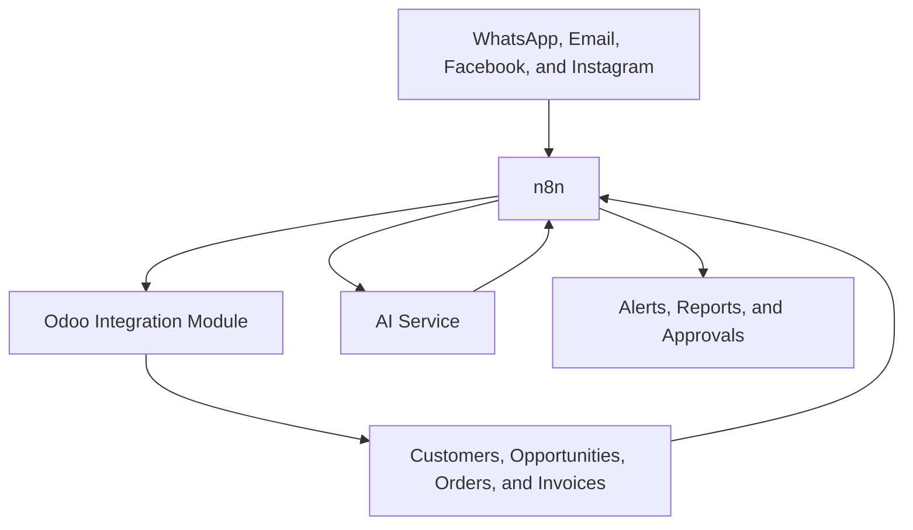

# Detailed Plan for Integrating Odoo with n8n, Marketing, and Digital Channels

## 1. Executive Summary

This project aims to build a unified operations, marketing, and sales follow-up system that connects Odoo Community, n8n, WhatsApp, email, Facebook, Instagram, and an AI service, so that the customer journey—from first interaction to sale and follow-up—becomes a clear, monitored, automated, and scalable process.

The goal is not only to connect systems, but to build a complete workflow that includes capturing leads, registering them inside Odoo, following up on conversations, generating marketing content, approving messages and posts, sending quotations, measuring results, and linking marketing outcomes to actual sales.

The expected final result is reduced manual work, faster response times, better operational discipline, and turning marketing from a separate activity into a function directly linked to sales and operations inside Odoo.

## 2. Project Concept

The main idea is to make Odoo the central data hub, n8n the workflow and integration engine, external channels such as WhatsApp, email, Facebook, and Instagram the communication channels for receiving and sending interactions, and AI a supporting tool for writing, classification, suggestions, and follow-up.

In simpler terms:

1. The customer comes from an ad, a message, or a form.
2. The system automatically captures their data.
3. The customer is registered inside Odoo as a contact or sales opportunity.
4. An initial reply or suitable follow-up is prepared.
5. The record is converted into a quotation or order when ready.
6. Its source and campaign result are measured.

## 3. Overall Project Objective

Build a unified operations, marketing, and follow-up platform that manages the full customer journey from first interaction through sale and post-sale, while centralizing data in Odoo, enabling automation through n8n, and connecting communication channels, marketing channels, and AI into one process.

## 4. Detailed Objectives

- Consolidate all customer data and interactions inside Odoo.
- Reduce manual entry, duplication, and operational errors.
- Speed up responses to messages and inquiries.
- Link marketing to actual sales, not only views or messages.
- Create organized follow-up flows for potential customers.
- Build an approval system before sending or publishing.
- Provide clear reports on business and marketing performance.
- Build a structure that can scale later without rebuilding the project from scratch.

## 5. Current Problem the Project Solves

In the traditional setup, data is spread across multiple tools, replies are handled manually, follow-up is inconsistent, and campaign results are not directly linked to sales inside Odoo. This causes:

- Some customers to be lost or replied to too late.
- Difficulty identifying the source of each customer.
- Weak follow-up after the first contact.
- Repetitive manual work across different systems.
- Difficulty measuring the real return from campaigns.

The project addresses these problems through one unified and connected workflow.

## 6. Overall Project Scope

### What Will Be Built

- A custom module inside the Odoo Community environment, placed in a dedicated custom add-ons path and not inside the core system files.
- A set of automated workflows in n8n for integration, execution, and follow-up.
- Official integration with WhatsApp Business.
- Official integration with email for sending, receiving, and follow-up.
- Integration with Facebook and Instagram pages, lead forms, and campaigns, according to officially available permissions.
- Integration with an AI service for suggestions, writing, classification, and assistance.
- A monitoring dashboard, operation logs, and result linkage inside Odoo.

### What Will Not Be Included in Phase One

- Any dependency on unofficial tools or anything that violates platform policies.
- Any complete rebuild of the Odoo interface from scratch.
- Any customizations not directly related to marketing, sales, and communication.
- Any deep accounting integration beyond what is required for the sales, collection, and tracking flow.

## 7. Expected Practical Outcome

After the project is completed, the expected workflow will be as follows:

- The customer sees an ad or post, or sends a message.
- The interaction enters the system automatically.
- A contact or sales opportunity is created in Odoo.
- A reply, follow-up, or task is prepared for the team.
- A quotation is created when needed.
- The customer is followed up automatically if they do not respond.
- The sale result is linked to the campaign or channel that brought the customer.
- You get a clear view of performance from the first interaction to the final step.

## 8. Project Stakeholders

- Project owner: defines objectives, policies, and final approvals.
- Sales team: receives opportunities and manages deals inside Odoo.
- Marketing team: prepares content and campaigns and approves publishing.
- Customer service team: handles messages and inquiries.
- Implementation company: builds the integration, module, workflows, and tests.
- System administrator: manages permissions, accounts, keys, and the operating environment.

## 9. Systems and Channels to Be Integrated

- Odoo Community as the central system.
- n8n as the workflow and execution engine.
- WhatsApp Business for receiving messages, sending replies, and follow-ups.
- Email for sending quotations, alerts, follow-ups, and receiving replies.
- Facebook for pages, messages, lead forms, and campaigns according to permissions.
- Instagram for engagement, publishing, and follow-up according to available permissions.
- An AI service through a production API, not through a personal-use subscription.

## 10. Project Architectural Principle

The core principle:

- Odoo is the main source of truth for the customer, opportunity, order, and invoice.
- n8n is the execution, integration, and automation layer.
- External channels are the sources of incoming and outgoing interactions.
- AI is a support assistant, not a replacement for the core business rules.

## 11. Components to Be Built in Detail

### 11.1 Integration Module Inside Odoo

A custom module will be built with the following responsibilities:

- Securely receive incoming data from n8n.
- Provide clear integration endpoints for dealing with customers, opportunities, orders, invoices, and inventory.
- Log every inbound and outbound operation in tracking records.
- Store external integration identifiers for each channel, campaign, or conversation.
- Provide internal events that n8n can rely on for follow-up.

### 11.2 n8n Workflows

Independent and clear workflows will be built, including:

- WhatsApp message intake workflow.
- Facebook lead form intake workflow.
- Email message and reply intake workflow.
- Customer creation or update workflow inside Odoo.
- Sales opportunity creation or update workflow.
- AI-assisted reply or content generation workflow.
- Approval workflow before publishing or sending.
- Actual publishing or sending workflow.
- Performance reporting and alert workflows.

### 11.3 AI Layer

It will be used for:

- Drafting initial replies.
- Writing marketing content.
- Summarizing long conversations.
- Classifying customers based on seriousness and interest.
- Suggesting the next sales or follow-up step.
- Rewriting messages in the company’s preferred tone.

### 11.4 Approval System

A mechanism will be created to prevent uncontrolled sending, so that:

- Any important content goes through approval.
- Any bulk message requires approval before execution.
- Any sensitive quotation can be routed for review.
- The approval or rejection decision is stored with its reason and date.

### 11.5 Reports and Logs

A clear logging system will be built, including:

- A log for every incoming and outgoing message.
- A log for every customer created or updated.
- A log for every campaign or content item linked to a channel.
- A log of errors and resend attempts.
- A log of approvals and decisions.

## 12. Core Data to Be Managed

The following data will be unified and linked:

- Customer data: name, mobile, email, city, source.
- Opportunity data: channel, product, stage, seriousness score, last contact.
- Campaign data: campaign name, platform, message, start date, result.
- Content data: text, channel, status, approval date, publishing date.
- Conversation data: channel, external identifier, summary, assigned owner, status.
- Order data: product, quantity, price, discount, quotation or order status.

## 13. Main Operational Flows

### 13.1 Customer Coming from an Ad or Form

Objective:
Convert any lead from campaigns into an organized sales opportunity inside Odoo.

Steps:

1. n8n receives the form or ad data.
2. The system validates the core data.
3. It searches for an existing customer by mobile number or email.
4. If none is found, a new customer is created inside Odoo.
5. A sales opportunity is created and linked to the source and campaign.
6. A responsible user or follow-up team is assigned.
7. An internal, WhatsApp, or email notification is sent to the responsible person.

Expected result:
No lead coming from campaigns is lost, and each one is linked to its correct source.

### 13.2 WhatsApp Flow

Objective:
Manage WhatsApp messages in an organized way and link them to sales and customer service.

Steps:

1. The message reaches n8n.
2. The customer is identified by phone number.
3. Their data is fetched from Odoo if available.
4. The message is saved in the interaction log.
5. A suggested reply or automated reply is prepared according to the rules.
6. When needed, a sales opportunity or follow-up task is created.
7. The interaction result and the last completed step are recorded.

Expected result:
Faster replies, better archiving, and linking every conversation to the right customer.

### 13.3 Email Flow

Objective:
Manage quotations, follow-ups, and email replies within a clear sales process.

Steps:

1. A quotation or follow-up is sent from the system.
2. A copy of the sent message is stored and linked to the customer or opportunity.
3. Replies are received if available.
4. The opportunity status is updated based on the reply.
5. A new follow-up or salesperson task is created when needed.

Expected result:
A clear record for every correspondence and a direct link between email and the deal.

### 13.4 Marketing Content Flow

Objective:
Organize the writing, approval, and publishing of content across different channels.

Steps:

1. The content topic or target objective is entered.
2. A content draft is generated through AI.
3. The text is reviewed internally.
4. The draft is sent for approval.
5. After approval, it is published or scheduled.
6. The post identifier, date, and related channel are saved.

Expected result:
Faster production while keeping the final decision in management’s hands.

### 13.5 Follow-Up Flow After No Response

Objective:
Prevent customer loss due to interrupted communication.

Steps:

1. The system identifies customers who have not responded within a defined period.
2. It sends a suitable follow-up through the preferred channel.
3. It updates the opportunity status after each follow-up.
4. It raises an internal alert if no response continues repeatedly.

Expected result:
Higher response rates and better chances of conversion to sale.

### 13.6 Conversion to Sale Flow

Objective:
Link the conversation or campaign to the actual commercial result.

Steps:

1. Once the customer is qualified, a quotation is created.
2. When the quotation is accepted, it is converted into an order.
3. The invoice or collection is recorded according to the Odoo workflow.
4. The result is linked to the campaign, source, and channel.

Expected result:
Real measurement of marketing return against sales.

## 14. Proposed Module Components Inside Odoo

The proposed module will include at minimum:

- General settings for integration, keys, and permissions.
- A unified interaction log.
- A campaign and channel register.
- A content and approval register.
- Additional integration fields inside customers, opportunities, and orders.
- Internal services for receiving and sending data with n8n.
- Alerts and internal messages linked to interactions.

## 15. Proposed Additional Fields Inside Odoo

The addition of fields such as the following will be studied:

- Customer source.
- Campaign name.
- External campaign identifier.
- Original channel.
- External conversation identifier.
- Last message or last interaction.
- Seriousness score.
- Last follow-up date.
- Content or message approval status.

## 16. Project Implementation Phases

### Phase 1: Analysis and Scope Approval

Objective:
Finalize the full project picture before development starts.

Tasks:

- Document the channels that are actually required for integration.
- Define the permissions of each user and team.
- Define the priority use cases.
- Approve the required data inside Odoo.
- Approve the policies for approvals and messages.

Deliverables:

- Final scope document.
- Approved integration list.
- Permissions and responsibilities list.

Acceptance criteria:
The document is approved by the project owner and the implementation company.

### Phase 2: Environment and Account Preparation

Objective:
Prepare all technical requirements before development begins.

Tasks:

- Prepare the n8n server.
- Prepare the custom add-ons path for Odoo.
- Prepare WhatsApp Business accounts.
- Prepare the official email accounts used for sending and receiving.
- Prepare page accounts, campaign accounts, and required permissions.
- Prepare secure access credentials and keys.

Deliverables:

- A ready development and testing environment.
- A list of active accounts and integrations.

Acceptance criteria:
Initial connectivity between the main systems is successful.

### Phase 3: Build the Odoo Module

Objective:
Create the core integration layer inside Odoo.

Tasks:

- Create the module in a custom add-ons path.
- Build settings, logs, and additional fields.
- Build the core integration endpoints with n8n.
- Connect customers, opportunities, orders, invoices, and inventory when needed.
- Build error logging and tracking.

Deliverables:

- An installable and usable module.
- Tracking and integration records inside Odoo.

Acceptance criteria:
n8n can successfully create or update a customer and an opportunity and read the status.

### Phase 4: Build the Core n8n Workflows

Objective:
Activate the operational structure for integration and automation.

Tasks:

- Build the WhatsApp intake workflow.
- Build the lead form intake workflow.
- Build the email receiving and sending workflow.
- Build the customer creation or update workflow inside Odoo.
- Build the internal alert workflow.

Deliverables:

- Stable core workflows.
- Working initial integration between channels and Odoo.

Acceptance criteria:
A test lead can move from the channel into Odoo without manual intervention.

### Phase 5: Build the AI Logic

Objective:
Add intelligent assistance for messages, content, and classification.

Tasks:

- Define the approved reply style.
- Prepare instruction templates specific to the business.
- Build the reply suggestion workflow.
- Build the content writing workflow.
- Build the customer classification and conversation summarization workflow.

Deliverables:

- Suggested replies and suggested content ready for review.
- Initial classification of potential customers.

Acceptance criteria:
Content and replies are generated consistently with the business policy.

### Phase 6: Build Approvals and Publishing

Objective:
Control the quality of sending and publishing before execution.

Tasks:

- Build a publishing approval cycle.
- Build an approval cycle for sensitive messages.
- Define who owns final approval.
- Record approval and rejection decisions.

Deliverables:

- A clear and documented approval flow.
- Controlled publishing and sending.

Acceptance criteria:
No important content is published or sent without approval.

### Phase 7: Build Reporting and Measurement

Objective:
Turn collected data into clear indicators.

Tasks:

- Build channel performance logs.
- Build customer source reports.
- Build sales conversion reports.
- Build alerts for failures or delays.

Deliverables:

- A monitoring screen or clear reports inside Odoo or through separate workflows.

Acceptance criteria:
It is possible to identify the source of each customer and the result of each main channel.

### Phase 8: Testing and Pilot Operation

Objective:
Ensure workflow integrity before full go-live.

Tasks:

- Test inbound and outbound scenarios.
- Test errors and retry logic.
- Test permissions and approvals.
- Test integration quality between channels and Odoo.
- Run a limited pilot operation.

Deliverables:

- Test report.
- Final observations and fixes list.

Acceptance criteria:
The main operating scenarios run successfully without major issues.

### Phase 9: Launch and Handover

Objective:
Move the project into actual use.

Tasks:

- Approve the final settings.
- Run the main workflows.
- Train key users.
- Deliver the operating documentation.

Deliverables:

- A system ready for use.
- Operation and handover documentation.

Acceptance criteria:
Users can perform daily work on the new system.

## 17. Final Project Deliverables

The expected handover from the implementation side includes:

- A custom Odoo module installed and configured.
- n8n workflows ready and clearly named.
- Integration settings for the approved channels.
- Documentation for settings and permissions.
- Documentation for the main flows.
- A short operating guide for the team.
- A basic maintenance and error-handling plan.

## 18. Requirements from the Client Side

For the project to succeed, the following must be provided:

- Access permissions to the appropriate Odoo environment.
- Permissions for the WhatsApp Business account.
- Permissions for the required pages, advertising accounts, or lead forms.
- The email details used for sending and receiving.
- A clear description of the desired reply style and tone.
- A list of the products or services being marketed.
- An internal approval process defining who reviews and who approves.

## 19. Important Technical Policies

- Development must be done in a custom module outside the core Odoo files.
- Odoo must remain the main source of truth for commercial data.
- The production project must not depend on a personal chat subscription, but on an AI service configured for API integration.
- It is preferable to start with stable official integrations in phase one.
- Sufficient logs must be kept to track every important operation.

## 20. Security and Permissions

The following will be considered:

- Separate operation accounts from users’ personal accounts.
- Define permissions for who can send, approve, and review.
- Store keys and sensitive data in secure settings.
- Prevent unrestricted direct access to sensitive data.
- Record key operations for later review.

## 21. Risk Management

Potential risks include:

- Delays or missing permissions from external platforms.
- Changes in the policies of external channels.
- Weak quality of the existing data inside Odoo.
- Lack of clarity in the approval process or team responsibilities.
- Excessive dependence on automated replies without controls.

Suggested mitigations:

- Start the project with official integrations only.
- Approve clear written permissions.
- Clean the core data before full operation.
- Set clear limits for what is automated and what requires human review.

## 22. Success Criteria

The project is considered successful if the following is achieved:

- New customers enter Odoo automatically from the approved channels.
- Every customer or opportunity is linked to a clear source.
- Initial response time is reduced.
- Repetitive manual work is reduced.
- Reports show the relationship between channels and sales.
- The main workflows remain stable in daily operation.

## 23. Proposed Performance Indicators

- Number of customers coming from each channel.
- First response time.
- Conversion rate from lead to opportunity.
- Conversion rate from opportunity to quotation.
- Conversion rate from quotation to sale.
- Number of messages or follow-ups executed automatically.
- Percentage of messages that required approval.
- Number of operational errors and retry success rate.

## 24. Estimated Timeline

Suggested project schedule:

- Week 1: Analysis, scope approval, and account preparation.
- Week 2: Build the core Odoo module.
- Week 3: Build the core n8n workflows.
- Week 4: Integrate WhatsApp, email, and lead forms.
- Week 5: Add AI and approvals.
- Week 6: Reporting, testing, and pilot operation.
- Week 7: Final fixes and launch.

The final duration may increase or decrease depending on the number of approved channels and the speed of providing permissions and data.

## 25. Expected Daily Workflow After Go-Live

In daily operation, the workflow will roughly be as follows:

- Marketing publishes content or runs a campaign.
- Interactions arrive from channels into n8n.
- n8n registers the customer inside Odoo or updates their data.
- A sales opportunity or follow-up task is created automatically.
- AI prepares a draft reply or content when needed.
- Management or the responsible person approves sending or publishing if required.
- The sales team completes the closing process inside Odoo.
- Reports display the results by source, campaign, and channel.

## 26. Proposed Future Expansions After Phase One

After phase one succeeds, the project can be expanded to include:

- More accurate retargeting campaigns.
- Deeper automatic customer segmentation based on behavior.
- Multi-stage follow-up message flows.
- Stronger integration with after-sales service and technical support.
- Expanded reporting to include profitability and customer retention.
- Additional channels if needed.

## 27. Implementation Recommendation

The practical recommendation is to execute the project in two logical stages:

- A stable and reliable first stage based on official integrations, core workflows, and clear data.
- A second stage for expansion, improvement, advanced AI, and deeper analytics after the core operation succeeds.

This approach reduces risks, increases the chance of success, and allows the project’s impact to be measured clearly from the beginning.

## 28. Final Summary

This project is not just a technical integration between tools. It is the construction of a complete commercial and marketing workflow that brings together:

- Customer acquisition.
- Registration and follow-up.
- Directing replies and tasks.
- Creating quotations and orders.
- Measuring campaign impact.
- Improving commercial and marketing decisions.

The expected result is a more disciplined system, faster response times, clearer measurement, and a stronger ability to convert digital interactions into actual sales inside Odoo.
